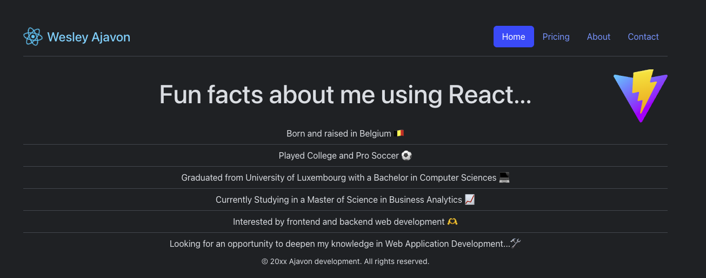

# First React

A simple React project that serves as a static personal information page.

## 📋 Description

**First React** is a beginner-friendly React application that displays a static web page with basic information about myself. It was created to get familiar with the fundamentals of React, including components, props, and JSX structure.

## 🚀 Features

- Built with [React](https://reactjs.org/)
- Fully static content — no backend
- Custom components for clean structure
- Styled using CSS or inline styles (depending on your implementation)

## 📁 Project Structure

first-react/
├── public/
│ └── index.html
├── src/
│ ├── components/
│ ├── App.jsx
│ ├── index.css
│ └── main.jsx
├── package.json
└── README.md

## 🛠️ Installation

To run the project locally:

1. **Clone the repository**  
   ```bash
   git clone https://github.com/wesleyajavon/first-react.git
   cd first-react
   npm install
   npm run dev


## 📸 Preview


